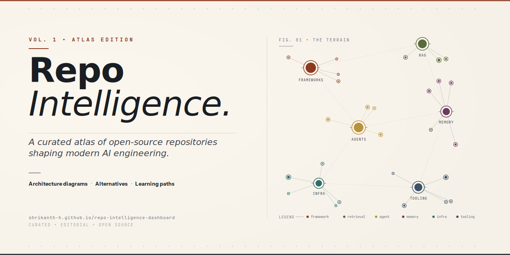

# Repo Intelligence Dashboard

> A curated atlas of open-source repositories shaping modern AI engineering — with architecture diagrams, alternatives, and learning paths for every entry. Single-file HTML, no build step.

[**View the live dashboard →**](https://shrikanth-h.github.io/repo-intelligence-dashboard/)



---

## What this is

An opinionated, hand-curated survey of the open-source landscape around AI agents, RAG systems, developer tooling, and inference infrastructure. Each repository in the atlas carries:

- A plain-language classification and intended audience
- A real-world use case (one paragraph, not a spec)
- An architecture diagram drawn in [Mermaid](https://mermaid.js.org/)
- Alternatives within the same problem space
- Install commands and common-use snippets
- Curated downstream implementations, templates, and learning resources

The goal is to shorten the distance between *"I've heard of this project"* and *"I understand whether to adopt it."* The dashboard is a starting point for evaluation — not a benchmark, not an endorsement.

## What this is not

- Not an exhaustive list. Breadth-first awesome-lists already do that well (see [kyrolabs/awesome-agents](https://github.com/kyrolabs/awesome-agents) and friends).
- Not a benchmark. Star counts and metadata are best-effort snapshots; refer to each repository for authoritative information.
- Not a substitute for trying things. Reading about a framework is preparation, not adoption.

## Sections

| Section                        | What it does                                                 |
| ------------------------------ | ------------------------------------------------------------ |
| **Summary**                    | Aggregate metrics, distribution by category and language     |
| **Index**                      | Searchable, filterable card grid of every repository         |
| **Repository cards**           | Expandable deep-dive per repo with diagram, features, alternatives, commands |
| **Comparison matrix**          | Scannable side-by-side of category, language, license, stars, forks, activity |
| **Learning paths**             | Curated implementations and tutorial channels per repository |
| **By category** / **By stack** | Two orthogonal groupings — purpose vs. technology            |
| **Add or update**              | A form that auto-fills from the GitHub API to streamline contributions |

## Running locally

It's a single HTML file with no build step.

```bash
git clone https://github.com/shrikanth-h/repo-intelligence-dashboard.git
cd repo-intelligence-dashboard
# any of the following works:
open index.html              # macOS
xdg-open index.html          # Linux
python3 -m http.server 8000  # any platform; visit http://localhost:8000
```

## Deep links

The URL state is part of the API:

- `?category=Memory%20%26%20context` — pre-filter the index by category
- `?q=mcp` — pre-fill the search box
- `#repo=langgraph` — open a specific repository card on load (also `#card-langgraph`)

These are shareable. Combine them: `?category=Memory%20%26%20context&q=mcp`.

## Contributing

PRs and suggestions are welcome. The cheapest path is the in-page form: open the **Add or update** section, paste a GitHub URL, and let the form auto-fill metadata; then file an issue with the resulting JSON, or open a PR directly. See [CONTRIBUTING.md](CONTRIBUTING.md) for the bar and the structure.

The atlas is opinion-driven; not every suggested repo will be added. That is the curation.

## Project status

Snapshot-based. Star counts and `lastUpdated` fields are filled by hand or by the in-page auto-fill at the moment of editing. A future workflow will refresh metadata on a schedule (this requires splitting the embedded data out into a separate JSON file — see [issue #1](https://github.com/shrikanth-h/repo-intelligence-dashboard/issues)).

The masthead carries the snapshot date. Treat anything older than ~3 months with appropriate skepticism.

## Tech notes

- Mermaid is loaded from jsDelivr; the page works offline if you replace the script tag with a local copy.
- A strict Content-Security-Policy is set; the only outbound connections are to `api.github.com` (the auto-fill form) and the font/Mermaid CDNs.
- The data array currently lives inside `index.html`. This will move to `repos.json` once the atlas crosses ~50 entries.
- Designed to render correctly with JavaScript disabled for the static fallback content (header, sections, footer); interactivity requires JS.

## License

[MIT](LICENSE) — free to fork, adapt, redistribute. Linked repositories are owned by their respective authors and listed for discovery only.

## Acknowledgements

Built with [Mermaid](https://mermaid.js.org/), the [IBM Plex](https://www.ibm.com/plex/) and [Fraunces](https://fonts.google.com/specimen/Fraunces) families, and a lot of patience. Inspired by the curation traditions of `awesome-*` lists — particularly [kyrolabs/awesome-agents](https://github.com/kyrolabs/awesome-agents) — while taking a different shape.

---

<sub>Curated by [@shrikanth-h](https://github.com/shrikanth-h). For corrections or new entries, open an [issue](https://github.com/shrikanth-h/repo-intelligence-dashboard/issues/new/choose).</sub>
